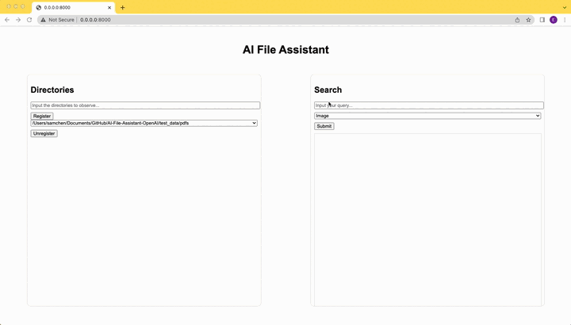

# AI-File-Assistant-OpenAI

Previously, I established a repository named [AI-File-Assistant](https://github.com/ErdongChen61/AI-File-Assistant). Although it was a solid start, the query experience didn't reach its full potential, primarily due to the limitations of my MacBook which lacked a robust GPU. This constraint prevented me from utilizing a large language model for fine-tuning the responses.

To overcome this hurdle, I decided to integrate OpenAI's models into this project. As a result, the user experience and the quality of responses have significantly improved compared to the initial version.

As for the costs associated with OpenAI, I conducted a trial run that involved indexing 5 images and 2 PDFs from the /test_data folder and performing a few simple queries. The entire process resulted in a cost of around $0.3. Whether to utilize OpenAI's API ultimately depends on your individual budget and how you perceive the value it brings to you.

## Examples
Register/Unregister directories:


Query files:


## Environment Setup
```
conda create -n AiFileAssistantOpenAI python=3.8.16
conda activate AiFileAssistantOpenAI

# Install Python dependencies
cd [parent_directory_of_project]/AI-File-Assistant-OpenAI
pip install -r requirements.txt

# Start AI-File-Assistant-OpenAI
# Remember to update main.py to include your own OpenAI API key.
sudo python main.py

# To interact with the assistant, input the following URL into your web browser: http://localhost:8000/
```

## Acknowledgements
This project utilizes a variety of open-source models and libraries, and I am immensely grateful for their contributions. Here are some of the key components that have played a crucial role:

[watchdog](https://pypi.org/project/watchdog/): for file change detection;

[FastAPI](https://fastapi.tiangolo.com/lo/): for web framework;

[PyPDF2](https://pypi.org/project/PyPDF2/): for PDF text extraction;

[easyocr](https://pypi.org/project/easyocr/): for image text extraction;

[chromadb](https://docs.trychroma.com/): for vector embedding database;

[langchain](https://python.langchain.com/en/latest/index.html): for large language model application framework;

[OpenAI](https://huggingface.co/): for embedding and large language models;